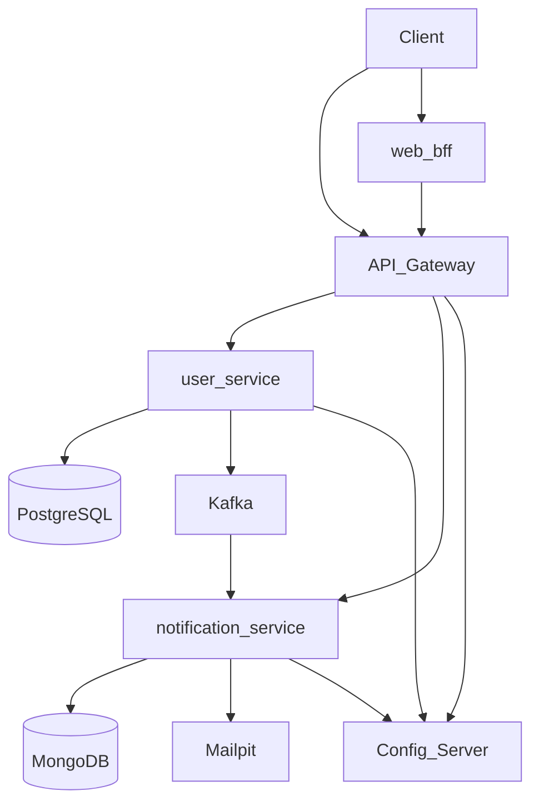

# Архитектура платформы

## Service Discovery

Eureka заменён на **Simple Discovery Client** + нативный DNS:

| Окружение | Механизм |
|-----------|----------|
| Docker Compose | `spring.cloud.discovery.client.simple.instances` в `config-repo/application-docker.yml` |
| Kubernetes | Cluster DNS + `config-repo/application-kubernetes.yml` |

Gateway маршрутизирует через `lb://user-service` / `lb://notification-service` — LoadBalancer использует static registry.

## Поток: создание пользователя

1. `POST /api/users` → user-service (JWT).
2. Транзакция + запись в `notification_outbox`.
3. Outbox relay → Kafka `user-notifications`.
4. Kafka consumer → запись в `notification_inbox` (PENDING).
5. Inbox relay → email → Mailpit/SMTP → статус PROCESSED.

## Режимы развёртывания

| Режим | Вход | Инструмент |
|-------|------|------------|
| Direct | `:8443`, `:8444` | docker compose |
| Cloud | nginx `:80` → Gateway / BFF | compose `--profile cloud` или Helm `edge.ingress` |
| Cloud (direct) | `:8080` Gateway | compose без nginx / отладка |
| Observability | Prometheus, Grafana | compose `--profile observability` |

## Сборка и CI

- **Gradle** multi-module monorepo.
- **CI/CD:** GitHub Actions (`.github/workflows/`).
- **CD:** Helm на Kubernetes (локально или GHCR-образы).
