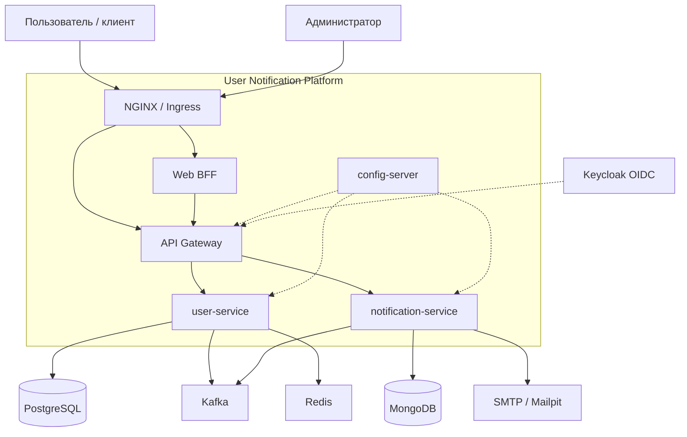

# C4: System Context

## Containers

| Container | Ответственность |
|-----------|-----------------|
| user-service | CRUD, JWT login, outbox |
| notification-service | inbox, email, service JWT / API key |
| api-gateway | JWT/OIDC edge, rate limit, TokenRelay |
| web-bff | API composition `/bff/me` |
